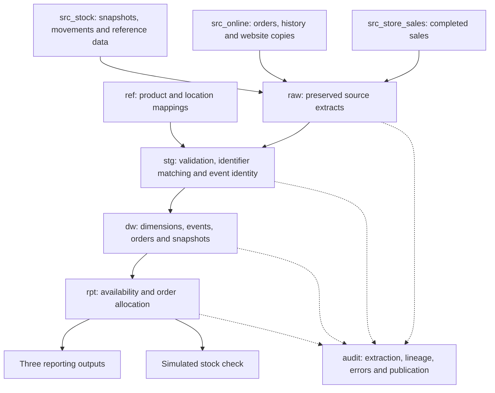

# PetHaven inventory prototype: architecture and data model

1 October 2026 · Implementation design, updated to match the prototype in `workspace/`

## 1. Purpose and authority

This document translates [Assignment2_Spec.md](../00_req_feedback/Assignment2_Spec.md) into an implementation design. The Spec remains the authority for business definitions, operating schedules, scope, and expected scenario results. The [assignment brief](../00_req_feedback/Assignment2_Requirements.md) defines the required deliverables. This document defines database responsibilities, names, table grains, integration rules, calculations, and a build sequence.

The prototype in `workspace/` implements this design. Where implementation needed a decision that an earlier draft left open, the decision is recorded in the relevant section of this document. What is not yet implemented, and the latest verification results, are listed in [implementation_notes.md](implementation_notes.md). The earlier customer/pet model and its Supabase scripts have been removed from the repository; they remain in Git history only.

The decisions below are the implementation baseline. They do not claim tutor approval. The business Spec was not changed to create this document.

### 1.1 Intended result

For a product at a selected store and observation time, the prototype will:

1. Reconstruct calculated on-hand stock from a reconciled opening snapshot and subsequent physical changes.
2. Reconstruct active reservations from online order history.
3. Calculate available stock and commitment shortfall.
4. Compare the result with the quantity the existing website would calculate.
5. Identify accepted C&C orders at risk and retain stock-related cancellations.
6. Show data timing and use the same availability calculation in a simulated stock check.

The warehouse does not accept live customer orders or control real reservations. The demonstration does not establish a guarantee against simultaneous purchases.

### 1.2 Implementation choices

| Decision | Choice | Reason |
| --- | --- | --- |
| Database model | Relational source tables and a dimensional warehouse | The problem concerns identifiable events, time, quantities, and shared dimensions |
| Execution environment | The provided Lab Environment, unchanged (`docker-compose.yml`, `python/Dockerfile`, `python/requirements.txt`); project code in `workspace/` | Required by the assignment brief. The compose file mounts only `./workspace`, so code placed elsewhere cannot run in the lab |
| SQL dialect | PostgreSQL 15 (lab image `postgres:15`) | Matches the workshop notes and the lab |
| Source representation | Three named schemas in one project database | Keeps business ownership separate and the lab prototype manageable |
| Scenario isolation | One isolated database per scenario (`pethaven_test_<scenario>`) on the lab server | Baseline and improved runs cannot mix; the lab's own `lab` database and shared databases are never reset |
| Integration | SQL transformations, called by a small Python runner | Makes the required extraction and transformation SQL inspectable and repeatable |
| Initial extraction | Full extraction of the small scenario dataset at each checkpoint | Avoids an unfinished change-capture implementation; supports retries and missing-record tests |
| Historical evidence | Immutable raw extracts, append-only event facts, saved report observations | Preserves both original evidence and the answer produced at a checkpoint |
| Product/location matching | Explicit reference tables | No customer matching, graph database, or enterprise MDM service is required |
| User interface | Three SQL report views with CSV export, and a simulated stock check | The report contracts are stable and tested; a graphical dashboard is not yet chosen |

Full extraction is a prototype choice, not a production scale recommendation. A later incremental extractor must handle changes to existing orders, late arrivals, and retries before replacing it.

## 2. Architecture

### 2.1 Existing business flow

```text
Till sale ------------------------> src_store_sales
Online order or status change ----> src_online
Receipt, transfer or adjustment --> src_stock

src_store_sales -- prior-day sales, imported at 1 am ------> src_stock
src_online ----- prior-day collections, imported at 1 am -> src_stock
src_stock ------ midnight snapshot, copied at 5 am ------> src_online
```

Central also processes locally recorded physical movements hourly. Its current stock can therefore include recent receipts while still missing store sales. The integrated calculation uses a dated reconciled snapshot, not that mixed-age current balance, as its opening quantity.

The website records its own orders immediately. Its daily stock refresh must not be described as a daily refresh of all online records.

### 2.2 Integration flow



Recent sales are read directly from `src_store_sales`; integration does not wait for central's overnight import. Raw, staging, and warehouse schemas are processing stages, not extra business sources.

### 2.3 Responsibilities

| Component | Owns | Does not own |
| --- | --- | --- |
| Source schemas | Synthetic operational records and the existing business schedules | Warehouse-derived availability |
| `raw` | Evidence of each extraction | Corrections to source values |
| `ref` | Approved identifier relationships | Stock balances or customer matching |
| `stg` | Validated, typed, matched records for a load | Permanent reporting history |
| `dw` | Integrated facts, dimensions, and provenance references | Checkout transactions |
| `rpt` | Shared calculations, saved observations, report views | A separate competing stock formula |
| `audit` | Runs, record lineage, validation issues, and publication state | Business stock movements |

Bronze, Silver, and Gold may be secondary labels in the report: raw extraction, validated integration, and the warehouse respectively. They are not database object names and do not imply separate services.

## 3. Database schemas and naming

### 3.1 Schemas to create

Create these nine schemas in each project database (one per scenario, section 14.1). A schema is a namespace, not an additional database server.

| Schema | Contents |
| --- | --- |
| `src_store_sales` | Store references, till product references, completed sales and lines |
| `src_online` | Online location references, orders, order history, website stock copies |
| `src_stock` | Products, barcodes, locations, transfers, movements, current balances and snapshots |
| `raw` | Source-shaped copies grouped by extraction run |
| `ref` | Source-system codes and product/location identifier mappings |
| `stg` | Validated records and canonical physical movement candidates |
| `dw` | Shared dimensions and integrated fact tables |
| `rpt` | Calculation functions, report observations and report views |
| `audit` | Load runs, extraction manifests, lineage and data-quality issues |

Do not create separate `bronze`, `silver`, `gold`, `mdm`, or `inventory_service` schemas in addition to these. They would duplicate responsibilities without a requirement. Do not put the new project tables in `public` merely to preserve the old Supabase API arrangement.

### 3.2 Object naming rules

| Object | Rule | Example |
| --- | --- | --- |
| General identifiers | Lower-case `snake_case`; no quoted mixed-case names | `recorded_at` |
| Source/reference tables | Singular business noun; avoid SQL keywords | `src_online.web_order` |
| Raw tables | Source prefix followed by source table name | `raw.store_sales_sale_line` |
| Staging tables | Singular subject name | `stg.stock_event` |
| Warehouse dimensions | `dim_` plus subject | `dw.dim_location` |
| Warehouse facts | `fact_` plus subject | `dw.fact_stock_movement` |
| Saved report tables | Subject name; avoid implying a source fact | `rpt.inventory_observation` |
| Report views | `v_` plus report subject | `rpt.v_availability_comparison` |
| Calculation functions | Descriptive verb or result | `rpt.calculate_inventory` |
| Source identifiers | `<entity>_id` for source IDs; `<entity>_code` for codes | `sale_id`, `store_code` |
| Warehouse surrogate keys | `<entity>_key` | `product_key`, `movement_key` |
| Quantities | Full `_quantity` suffix | `reserved_quantity` |
| Timestamps | Meaningful `_at` suffix | `occurred_at`, `recorded_at`, `copied_at` |
| Constraints | `pk_`, `fk_`, `uq_`, `ck_` plus short table/column description | `uq_dim_product_sku` |
| Indexes | `ix_` plus table and search columns | `ix_stock_movement_product_location_time` |

Use schema-qualified names in scripts. Do not encode a use-case number, team member, environment, or medallion colour in a business table name. Use `stock` consistently for physical source records and `inventory` for the calculated observation.

### 3.3 Types and common conventions

- Source IDs, SKUs, barcodes, and location codes are `text`. Preserve leading zeros and case where meaningful. Do not silently trim or change an identifier and discard the original.
- Warehouse keys and run IDs are generated `bigint` values.
- Source quantities are `integer`. Line quantities are positive; physical movements use signed quantities. Aggregations and saved totals use `bigint`.
- Prices use `numeric(12,2)`. Pack-size values can use `numeric(12,3)` with a separate unit. Selling quantity is whole sellable packs, not kilograms; pack size is a product attribute.
- Business and processing timestamps use `timestamptz`. Interpret scenario dates in `Australia/Sydney`; do not assume a permanent UTC offset. Reporting dates are Sydney business dates.
- Use `date` for `dw.dim_date.full_date` and an integer `date_key` in `YYYYMMDD` form.
- Source keys, source quantities, event times, and mandatory relationships below are `NOT NULL` unless expressly optional. Calculated report quantities are nullable when their basis is unknown, as described in section 13. Descriptive attributes and optional references must have their nullability declared explicitly in the DDL.
- Source foreign keys stay within their source schema. Cross-source identifiers are text references checked during integration. This keeps the simulated business sources independent.
- Use ordinary foreign keys inside reference, warehouse, reporting, and audit structures. Warehouse facts must not depend on live source rows through foreign keys.
- Fixed status/type sets use named `CHECK` constraints. Do not add separate lookup tables for every small fixed list without a reporting need.

### 3.4 English comments and code documentation

All implementation comments, Python docstrings, and database object descriptions must be written in clear English. This applies to schema creation, source jobs, extraction and transformation SQL, reporting functions, fixture scripts, and tests. A teammate should be able to understand a component without reading the original chat or asking its author to translate a comment.

Use two complementary forms of documentation:

- **File comments and docstrings** explain execution order, business rules, dependencies, and important implementation decisions to someone reading the repository.
- **PostgreSQL `COMMENT ON` statements** store object descriptions in the database so teammates can inspect them through database tools. Place these statements beside the relevant DDL and apply them with the schema scripts.

Neither form replaces the other. A schema is a database namespace, not a code file; its role should be explained both in its creation file and in the database catalogue.

#### Required coverage

| Component | Required explanation |
| --- | --- |
| Every schema | Its responsibility, whether it represents a business source or an internal processing stage, and its main boundary |
| Every table | What one row represents, where its data comes from, and whether rows are current state, immutable history, or rebuildable working data |
| Key business columns | Identifier ownership, units/sign conventions, timestamp meaning, code meanings, and meaningful null values |
| Every report view | The business question, result grain, calculation basis, and any important filtering |
| Every database function/procedure | Purpose, inputs, returned result, side effects, transaction ownership, and invalid-input/failure behaviour |
| Every executable SQL/Python file | Purpose, prerequisites, inputs, outputs, execution method, transaction boundary, and rerun/reset behaviour |
| Non-obvious transformations | Why the rule exists, including event deduplication, cutoff boundaries, reservation changes, and historical status selection |
| Every scenario/test | The business condition being exercised and the independently expected result |

Use `COMMENT ON SCHEMA`, `COMMENT ON TABLE`, `COMMENT ON COLUMN`, `COMMENT ON VIEW`, and `COMMENT ON FUNCTION`/`PROCEDURE` as appropriate. Routine comments must identify the actual implemented argument types so overloaded routines are documented correctly. Explain non-obvious constraints and indexes beside their DDL, including the integrity rule or query they support.

Do not add a comment to every obvious assignment, join, or SQL keyword. Explain business meaning and reasons, rather than repeating the statement in English. Keep comments accurate when logic changes; a claim such as "safe to rerun" must describe the actual duplicate checks or reset behaviour.

#### Schema descriptions

Use the following English descriptions in `workspace/db/01_schemas.sql`, after creating the corresponding schemas:

```sql
COMMENT ON SCHEMA src_store_sales IS
'Store sales business source. Records completed till sales and sale lines. Does not maintain inventory balances or online reservations.';

COMMENT ON SCHEMA src_online IS
'Online orders business source. Records accepted orders, status history and website stock copies. Active reservations are derived from order lines and status history.';

COMMENT ON SCHEMA src_stock IS
'Central stock business source. Records products, locations, physical movements, current recorded balances and reconciled snapshots for stores and the distribution centre.';

COMMENT ON SCHEMA raw IS
'Internal extraction layer. Preserves source-shaped records and their identifiers for each load run. Extracted values are retained as evidence rather than corrected in place.';

COMMENT ON SCHEMA ref IS
'Internal reference mappings. Links source product and location identifiers to shared identifiers. Does not maintain stock balances.';

COMMENT ON SCHEMA stg IS
'Internal integration work area. Holds validated and matched records for a load run, including canonical physical event identities. It is not permanent reporting history.';

COMMENT ON SCHEMA dw IS
'Integrated dimensional warehouse. Stores shared dimensions, physical events, order history, opening snapshots and website copies. Does not operate live checkout.';

COMMENT ON SCHEMA rpt IS
'Inventory calculations and reporting. Provides shared availability and order-risk calculations, saved observations, report views and the simulated stock check.';

COMMENT ON SCHEMA audit IS
'Pipeline execution records. Tracks extraction, validation issues, lineage, mapping changes and publication. Does not represent an additional business data source.';
```

#### Table and column examples

The following examples belong beside the relevant table definitions, after those objects exist:

```sql
-- Preserve each transition so a historical stock calculation can recover
-- the order's status at the observation time, even after cancellation.
COMMENT ON TABLE src_online.order_status_history IS
'One recorded status transition per online order event. History is retained; corrections append an explicitly linked event rather than overwrite an earlier transition.';

COMMENT ON COLUMN src_online.order_status_history.occurred_at IS
'Business time at which the status transition took effect. Used with event_sequence to reconstruct order state at an observation time.';

COMMENT ON COLUMN src_online.order_status_history.recorded_at IS
'Time the online source recorded this transition. Distinct from its business occurrence time and the later warehouse load time.';

COMMENT ON COLUMN dw.fact_stock_movement.quantity IS
'Signed change in whole sellable units at one location. Positive values add stock; negative values remove stock. Reservations are not physical movements.';

COMMENT ON COLUMN rpt.inventory_observation.available_quantity IS
'Quantity available for a new commitment at the saved observation and load. Null when the calculation cannot establish availability; zero means known unavailability.';
```

Use short inline explanations at the point where an implementation could otherwise be misread. For example:

```sql
-- The opening snapshot already includes events strictly before its cutoff.
-- Include an event exactly at the cutoff in the subsequent movement total.
-- Count an imported central copy under its original event identity so the
-- corresponding till sale or online collection is not deducted twice.
```

#### Script header example

Use a concise header with concrete values for the actual script. This example is the header of the warehouse loader (`workspace/db/etl/load_warehouse.sql`); update it if the implementation contract changes:

```sql
-- Purpose: Publish validated records from one load run to the warehouse.
-- Prerequisites: The selected run has complete extracts and no validation errors.
-- Inputs: Run-scoped staging records and approved identifier mappings.
-- Outputs: Warehouse dimensions, facts, lineage and successful publication state.
-- Execution: Called by scripts/run_pipeline.py with a bound load_run_id.
-- Transaction: The runner owns one transaction for all publication writes.
-- Rerun behaviour: Equal business identities are retained once. Conflicting
--                 values reject the load; existing facts are not overwritten.
-- Failure behaviour: Roll back publication writes and retain raw evidence.
-- Business rules: Architecture_and_Data_Model.md, sections 8 and 12.
```

Python entry points should carry equivalent module/function docstrings. Document command-line arguments and distinguish a normal repeat run from an explicitly destructive fixture reset. Keep credentials and personal information out of comments and examples.

Before merging an implementation change, check that the affected objects have English descriptions, changed rules have matching comments, and the explanations agree with the tested behaviour. Treat stale or misleading comments as part of the change to fix, not as documentation to leave for later.

## 4. Source data model

The table lists below define the logical minimum. Add technical implementation fields only when their purpose is documented. Required cross-row rules must be enforced by a source write procedure or transaction and verified in tests; a row-level check constraint alone cannot enforce them.

The source write procedures are in `workspace/db/source_actions/`:

| Source | Procedures |
| --- | --- |
| Store sales | `src_store_sales.record_sale` |
| Online orders | `src_online.place_order`, `src_online.change_order_status` |
| Central stock | `src_stock.bootstrap_opening_snapshot` (first fixture balance only), `record_supplier_receipt`, `create_transfer`, `dispatch_transfer`, `receive_transfer`, `record_adjustment`, `record_reversal` |

Each procedure runs in the caller's transaction, so a header and its lines, or a current status and its history event, are written together.

### 4.1 Store sales: `src_store_sales`

| Table | Grain and key | Required attributes and relationships |
| --- | --- | --- |
| `store` | One store code; PK `store_code` | `store_name`, `suburb` |
| `product` | One till-recognised barcode; PK `barcode` | `product_name`, `unit_price`; price non-negative |
| `sale` | One completed purchase; PK `sale_id` | `store_code` FK to `store`, `till_id`, `completed_at`, `recorded_at` |
| `sale_line` | One line in a sale; PK `(sale_id, line_id)` | `sale_id` FK to `sale`, `barcode` FK to local `product`, `quantity`, `unit_price` |

Each sale has at least one line. Lines are written with the header in one transaction. A completed line reduces physical stock by its quantity at `completed_at`. No stock balance or reservation table belongs in this source.

An unknown central barcode can still exist in the till's local product list. That is a valid way to test an integration mapping failure without violating the local source foreign key.

### 4.2 Online orders: `src_online`

| Table | Grain and key | Required attributes and relationships |
| --- | --- | --- |
| `fulfilment_location` | One online location code; PK `location_code` | `location_name`, `location_type` (`store` or `dc`) |
| `web_order` | One accepted order; PK `order_id` | `placed_at`, `recorded_at`, `fulfilment_type`, `location_code` FK, `current_status`, `updated_at` |
| `web_order_line` | One product line; PK `(order_id, line_id)` | FK to `web_order`, `sku`, positive `quantity`; unique `(order_id, sku)` |
| `order_status_history` | One status event; PK `event_id` | FK `order_id`, `event_sequence`, nullable `previous_status`, `new_status`, `occurred_at`, `recorded_at`, nullable `reason_code`, nullable `corrects_event_id` self-FK |
| `web_stock_copy` | One copied SKU/location balance in a refresh; PK `(copy_id, sku, location_code)` | `location_code` FK, `on_hand_quantity`, `source_snapshot_id`, `snapshot_cutoff_at`, `copied_at` |

`fulfilment_type` is `click_collect` or `home_delivery`. C&C requires a store; home delivery requires the DC. The main scenarios exercise C&C. If home-delivery fixtures are added, use `shipped` as its terminal physical-outgoing status; it must never become a till sale.

For each order, `(order_id, event_sequence)` is unique. Sequences start at 1, follow the recorded transition order, and resolve equal event timestamps. Source writes must maintain the current status and append history in the same transaction. Order lines and fulfilment location are fixed after acceptance in this prototype.

Normal C&C transitions:

```text
new order -> awaiting_pick -> ready -> collected
                  |            |
                  +-> cancelled <+
```

The initial history event has no previous status and has `new_status = awaiting_pick`. `collected` and `cancelled` are terminal for normal operations. Cancellation requires a reason, including `insufficient_stock` or `customer_request`. A history correction is explicitly linked and audited; it is not an ordinary reopening of a completed order. See section 10.5.

Use the status set `awaiting_pick`, `ready`, `collected`, `shipped`, `cancelled`. The source write procedure rejects `shipped` for C&C and `collected` for home delivery. In the optional home-delivery path, `ready -> shipped` replaces `ready -> collected`. Validate non-decreasing occurrence times with increasing event sequence; an earlier business-time correction requires an explicit restatement design and is not silently inserted into this sequence.

The `source_snapshot_id` in `web_stock_copy` is a reference to central's record, not a cross-source FK. A copy is immutable. A refresh replaces the application's selected copy, not the historical row. All rows in one `copy_id` must have consistent refresh metadata.

There is no independent reservation table. Active reservation quantities are derived from lines and history. A rejected simulated request does not create an accepted `web_order`.

**Order acceptance by the existing website.** Spec 4.2 steps 2–3 say the website accepts an order only when its own calculation shows enough stock. `src_online.place_order` therefore calls `src_online.website_available_quantity`, the Spec 5.3 formula over the website's own copy and order history, for every line. If any line is short, it raises an error and writes nothing. This is why the baseline run accepts Sarah's order: the website's outdated calculation still shows four bags. When the website has no copy for a product and location, the source treats it as out of stock (zero). The warehouse baseline (section 10.2) reports the same situation as unknown (`missing_copy`), because the warehouse does not guess.

### 4.3 Central stock: `src_stock`

| Table | Grain and key | Required attributes and relationships |
| --- | --- | --- |
| `product` | One product; PK `sku` | `product_name`, `brand`, `category`, `pack_size`, `pack_unit`, `is_active` |
| `product_barcode` | One barcode-to-product link; PK `barcode` | FK `sku`; several barcodes may identify one SKU |
| `location` | One physical location; PK `location_code` | `location_name`, `location_type` (`store` or `dc`), `suburb` |
| `external_location_code` | One code another existing system uses for a central location; PK `(system_code, external_code)` | `system_code` (`store_sales` or `online`), FK `location_code` |
| `stock_transfer` | One transfer; PK `transfer_id` | FKs `origin_location_code`, `destination_location_code`, `created_at`, `current_status`; origin and destination must differ |
| `stock_transfer_line` | One transfer line; PK `(transfer_id, line_id)` | FK to header, FK `sku`, positive `quantity` |
| `stock_movement` | One physical change at one location; PK `movement_id` | FKs `sku`, `location_code`; `movement_type`, signed `quantity`, `occurred_at`, `recorded_at`; origin identity and optional references described below |
| `stock_on_hand` | One current recorded balance; PK `(sku, location_code)` | FKs to product/location, `on_hand_quantity`, `updated_at` |
| `stock_snapshot` | One reconciled balance at a cutoff; PK `(snapshot_id, sku, location_code)` | FKs to product/location, `on_hand_quantity`, `cutoff_at`, `created_at` |
| `movement_application` | One application of a movement to the current balance; PK `movement_id` | FK to `stock_movement`, `applied_at` |

`stock_movement` additionally has:

- `origin_system_code`, `origin_event_type`, `origin_event_id`, `origin_line_id`: mandatory original business identity; use the fixed text `0` for an event with no line.
- Nullable `(transfer_id, transfer_line_id)`: composite FK to the transfer line when relevant.
- Nullable `delivery_reference` and `supplier_reference`: required as appropriate for a supplier receipt; no full purchasing subsystem is needed.
- Nullable `reason_code`: required for an adjustment or reversal.
- Nullable `reverses_movement_id`: self-FK when reversing an existing central movement.

`external_location_code` exists because the existing 1 am import must translate till store codes (for example `0123`), and the 5 am refresh must translate central codes into website pickup codes (for example `store-parramatta`). These jobs ran before the warehouse existed, so they use central's own list rather than the warehouse's `ref` mappings. Integration does not trust this table; it uses only the reviewed `ref.location_identifier` mappings (section 5.2). The table is still extracted to `raw` like every other source table.

The four origin-identity columns form a unique constraint. An overnight import uses the original store sale or online collection identity. A locally created movement uses its own stock movement ID and origin system `stock`. Section 8 defines the identities exactly.

Allowed movement types and signs:

| Type | Sign | Physical meaning |
| --- | --- | --- |
| `supplier_receipt` | Positive | Goods received at the DC |
| `transfer_dispatch` | Negative | Goods leave the origin |
| `transfer_receipt` | Positive | Goods arrive at the destination |
| `adjustment` | Non-zero, either sign | Confirmed signed count correction |
| `store_sale` | Negative | Imported completed till sale |
| `online_collection` | Negative | Imported C&C collection |
| `online_shipment` | Negative | Imported home-delivery shipment, if exercised |
| `reversal` | Opposite of referenced event | Explicit correction, with a reason |

Creating a transfer creates no physical movement. Dispatch and receipt create distinct movements, linked to the same transfer line. For the initial complete-transfer model, allow one dispatch and one receipt per line; validate quantities and origin/destination against the line/header. Transfer timestamps are obtained from those movements rather than maintained as a second independent event history.

Transfer `current_status` is `created`, `dispatched`, or `received`. For a multi-line transfer, the fixture's full dispatch/receipt operation creates all corresponding line movements and updates status in one transaction. Non-negative source stock/snapshot/copy quantities are required for the supplied scenarios; signed movement quantities remain the mechanism for reductions. Invalid source imports must remain visible as extraction/validation errors.

`movement_application` records application of local and imported movements alike. The hourly and overnight jobs update a balance and record its application in the same transaction. Re-running either job cannot apply the same movement twice.

Snapshots are immutable. Rows sharing a snapshot ID must share cutoff and creation time. Snapshot generation is described in section 11; copying current balances at 1 am is not sufficient.

### 4.4 Conceptual relationships

```text
Store -> Sale -> Sale line -> Scanned barcode -> Product
Fulfilment location -> Online order -> Order line -> Product
Online order -> Status history
Product + Location -> Stock movement
Transfer -> Transfer line -> Dispatch and receipt movements
Product + Location + Cutoff -> Opening snapshot
Product + Online location + Refresh -> Website stock copy
```

Some arrows represent integration mappings rather than source foreign keys. In the warehouse, products and locations become shared dimensions. Order ID and line ID remain available for tracing a report to its business record.

## 5. Raw extraction and reference mappings

### 5.1 `raw` tables

Create one raw table for each source table in section 4. Names follow these examples:

```text
src_store_sales.sale                  -> raw.store_sales_sale
src_store_sales.sale_line             -> raw.store_sales_sale_line
src_online.order_status_history       -> raw.online_order_status_history
src_online.web_stock_copy             -> raw.online_web_stock_copy
src_stock.stock_movement              -> raw.stock_stock_movement
src_stock.stock_snapshot              -> raw.stock_stock_snapshot
```

The repeated `stock` in `raw.stock_stock_movement` is deliberate: source prefix plus unchanged table name. Apply the rule consistently rather than inventing exceptions.

Each raw table retains all source columns and adds `raw_record_id` (PK), `load_run_id` (FK to `audit.load_run`), and `extracted_at`. Add a unique constraint on `(load_run_id, <source primary key columns>)`. Source-to-source FKs are not copied into raw; incomplete extracts must be recordable and detectable.

Raw source columns preserve the values and compatible types of the controlled relational sources. Do not impose the source's business check constraints in raw. If a connector cannot parse a row at all, record an extraction error and fail that extraction; do not silently discard it. A general untyped JSON landing platform is unnecessary for the initial three PostgreSQL sources.

A second extraction may contain another copy of a record. That is valid extraction evidence. Its presence must not add another warehouse business fact.

### 5.2 `ref` tables

| Table | Key | Attributes and purpose |
| --- | --- | --- |
| `source_system` | PK `system_code` | Seed `store_sales`, `online`, `stock`; descriptive name |
| `product_identifier` | PK `(system_code, identifier_type, identifier_value)` | FK system code; `sku`, `approved_at`, `mapping_basis`; types `barcode` and `sku` |
| `location_identifier` | PK `(system_code, location_code)` | FK system code; `canonical_location_code`, `approved_at`, `mapping_basis` |

Product mappings are populated from validated central product/barcode extracts. SKU self-mappings are explicit for online and stock records. Location mappings are a small reviewed seed file, checked against central locations and source location references.

Example location mappings:

| system_code | location_code | canonical_location_code |
| --- | --- | --- |
| `store_sales` | `0123` | `STR-PAR` |
| `online` | `store-parramatta` | `STR-PAR` |
| `stock` | `STR-PAR` | `STR-PAR` |

Do not match by product name, suburb alone, or approximate text. A missing or ambiguous mapping is a data-quality issue. Do not assign it to a default product or store.

The first prototype fixes mappings during a scenario run. Adding a previously missing correct mapping allows a new load to process the preserved raw evidence. Changing an already-used mapping to a different product/location requires a documented correction or a clean scenario rebuild, not silent rewriting of published history. Record mapping changes in `audit.mapping_change`.

## 6. Validation and integration: `stg`

Staging is a work area rebuilt for each load. Include `load_run_id` in staging keys and restrict every transformation to that run. Retaining staging from several runs is optional; raw extracts and published warehouse/report records are the durable evidence.

Create these staging tables:

| Table | Grain | Main fields |
| --- | --- | --- |
| `product` | One canonical SKU in the run | SKU and validated product attributes |
| `location` | One canonical location in the run | Canonical code and validated attributes |
| `stock_event_candidate` | One raw representation of a physical event line | Raw table and record ID, origin identity, whether it is the original representation, matched SKU and location, type, signed quantity, event time, recording time, supporting header/event row |
| `stock_event` | One canonical physical event line | Origin identity, SKU, canonical location, type, signed quantity, event time, original recording time |
| `order_line` | One online order line | Order/line IDs, SKU, canonical location, quantity, placement time, fulfilment type |
| `order_status_event` | One status event | Event/order IDs, sequence, previous/new status, times, reason, correction reference |
| `stock_snapshot` | One snapshot/product/location balance | Snapshot ID, cutoff, creation time, quantity |
| `web_stock_copy` | One refresh/product/location balance | Copy ID, referenced snapshot, cutoff, copy time, quantity |

`stock_event_candidate` implements step 1 of section 8.2: every representation is staged first, then compared. A canonical `stock_event` is created only for an identity whose representations are all matched and agree, and it takes its attributes from the original representation.

For stock-event candidates, direct sales use sale completion time and header recording time. Direct collections expand a collection status event into one physical movement per order line. Locally created central movements are read directly. Imported central sales/collections supply additional evidence for the same origin identity.

Validate before loading:

1. Required headers, lines, and source references exist.
2. Product and location identifiers have exactly one approved match.
3. Quantities, signs, and fulfilment locations follow the source rules.
4. Order sequences and transitions are coherent; first acceptance and final current status agree with history.
5. Duplicate representations of an origin identity agree on product, location, quantity, and occurrence time.
6. Snapshot metadata is consistent and its referenced products/locations are valid.
7. A collection status and all of its line movements can be published together.

Do not infer an unrecorded sale, collection, receipt, or cancellation to make a quantity look reasonable. Do not fill missing quantities with zero.

For the first implementation, any unresolved error blocks warehouse publication for the whole load. Preserve the raw extract and issue records. Warnings may be published with an explicit warning count. This conservative rule avoids releasing half an order or a stock answer missing an unmatched sale. Section 13 describes how reports handle the last successful load.

A pre-cutoff late record (section 10.5) is recorded as a **warning** (`pre_cutoff_late_event`), not an error. Treating it as an error would block every product in the load because of one product/location. Instead, the load publishes and the calculation marks only the affected pair `reconciliation_required`, with no stock quantity.

Validation runs in two routines, in the same transaction:

- `stg.validate_sources` (`workspace/db/etl/validate_sources.sql`) handles rules 1, 2 (mapping refresh), 4 and 6, plus mapping targets.
- `stg.prepare_staging` (`workspace/db/etl/prepare_staging.sql`) handles unmatched identifiers, rules 5 and 7, conflicts with already published facts, and late records.

## 7. Dimensional warehouse: `dw`

### 7.1 Dimensions

| Table | Key and unique business key | Attributes |
| --- | --- | --- |
| `dim_product` | PK `product_key`; unique `sku` | `product_name`, `brand`, `category`, `pack_size`, `pack_unit`, `is_active`, `first_load_run_id` |
| `dim_location` | PK `location_key`; unique `location_code` | `location_name`, `location_type`, `suburb`, `first_load_run_id` |
| `dim_date` | PK `date_key`; unique `full_date` | Calendar year, month, day, weekday |

Facts reference dimensions with surrogate keys. Exact timestamps remain on the facts; a date key is insufficient for the scenarios. Derive date keys using Sydney business time.

Product and location attributes are fixed during the initial scenarios. Do not implement slowly changing dimensions without a historical attribute requirement. If later attribute changes must be analysed, extend this decision explicitly; do not claim the initial dimensions preserve every past description.

No `dim_channel` is required for inventory balances. Order fulfilment type and movement type identify relevant activities. A physical DC is a location type, not a sales channel.

### 7.2 Facts

| Table | Grain and uniqueness | Required fields beyond generated PK |
| --- | --- | --- |
| `fact_stock_movement` | One original physical event line; unique four-part origin identity | `movement_key`, origin identity, product/location/date keys, `movement_type`, signed `quantity`, `occurred_at`, `source_recorded_at`, optional transfer/delivery/reversal references, `first_load_run_id`, `warehouse_loaded_at` |
| `fact_order_line` | One accepted online order line; unique `(order_id, line_id)` | `order_line_key`, order/line IDs, product/location/placed-date keys, `quantity`, `placed_at`, `source_recorded_at`, `fulfilment_type`, `first_load_run_id`, `warehouse_loaded_at` |
| `fact_order_status_event` | One online status event; unique `event_id` and `(order_id, event_sequence)` | `order_status_key`, event/order IDs, event sequence, event-date key, previous/new status, reason/correction reference, `occurred_at`, `source_recorded_at`, `first_load_run_id`, `warehouse_loaded_at` |
| `fact_stock_snapshot` | One opening product/location balance; unique `(snapshot_id, product_key, location_key)` | `snapshot_key`, source snapshot ID, product/location/cutoff-date keys, `on_hand_quantity`, `cutoff_at`, `created_at`, `first_load_run_id`, `warehouse_loaded_at` |
| `fact_web_stock_copy` | One copied product/location balance; unique `(copy_id, product_key, location_key)` | `web_copy_key`, source copy ID, product/location/copy-date keys, `on_hand_quantity`, source snapshot ID, `snapshot_cutoff_at`, `copied_at`, `first_load_run_id`, `warehouse_loaded_at` |

The PK name shown in each row is the generated key, not an additional non-key field. All product/location/date columns are FKs. `first_load_run_id` is an FK to `audit.load_run` and must never be changed by a repeat extraction. `warehouse_loaded_at` is the actual insertion timestamp, not the event's business time.

Use the exact FK column names `product_key` and `location_key`. Use `event_date_key` on movement/status facts, `placed_date_key` on order lines, `cutoff_date_key` on snapshots, and `copy_date_key` on website copies; each references `dim_date.date_key`. Preserve `order_id` and `line_id` on online collection movements as well as the collection's four-part origin identity. Preserve `transfer_id`, `transfer_line_id`, and delivery references on applicable movements. Resolve a reversal to `reverses_movement_key` (nullable self-FK); load the original first. Keep the original source reversal reference in raw and lineage.

`order_id` is a retained business identifier linking order lines to status events. Status events are stored once per order, not repeated per line. Validate that every status event has a corresponding accepted order and that all its lines are loaded. Reports must obtain one effective status per order before joining to lines; directly joining every history row would multiply quantities.

Facts do not overwrite previous events. Exact duplicates are no-ops after equality checks. Conflicting content under the same business identity is an error, not an instruction to update the fact. Corrections follow section 10.5.

Stock balances are additive across distinct locations/products where the units make sense, but not across time. Do not sum repeated daily snapshots to obtain current stock. Pack quantities for different products should not be presented as a meaningful weight total.

### 7.3 Indexes

Start with PK/unique indexes, then add the following access paths:

- `fact_stock_movement(product_key, location_key, occurred_at)`.
- `fact_stock_snapshot(product_key, location_key, cutoff_at)`.
- `fact_web_stock_copy(product_key, location_key, copied_at)`.
- `fact_order_line(location_key, product_key, placed_at, order_id)`.
- `fact_order_status_event(order_id, occurred_at, event_sequence)`.
- Raw `(load_run_id)` indexes where the existing composite unique index does not cover the access pattern.

Do not add partitioning or materialised views to meet a perceived complexity requirement. Use query plans and a documented larger fixture if performance work is needed.

## 8. Event identity and lineage

### 8.1 Canonical identity

Use four separate text columns rather than an ambiguous concatenated string:

```text
(origin_system_code, origin_event_type, origin_event_id, origin_line_id)
```

| Business event | Canonical identity |
| --- | --- |
| Till sale line | `('store_sales', 'sale', sale_id, line_id)` |
| C&C collection line | `('online', 'collection', status_event_id, order_line_id)` |
| Shipment line, if exercised | `('online', 'shipment', status_event_id, order_line_id)` |
| Local central movement | `('stock', 'movement', movement_id, '0')` |

The originating online order ID remains a separate attribute because a status event ID identifies the collection. Imported central rows must preserve the same identity as their original sale/collection.

Dispatch and receipt are separate local movements and therefore separate identities. Transfer header/line records never create additional movements during integration.

### 8.2 Duplicate handling

For each identity:

1. Gather all raw representations from the run.
2. Compare their economic attributes: product, location, signed quantity, and event time.
3. If they disagree, block publication and record the conflicting raw references.
4. If they agree, load one physical fact and attach every representation as lineage.
5. If the fact already exists, validate equality and append only newly observed lineage.

The initial complete-source extractor requires original sale/collection records for imported copies. An imported copy without its original is an extraction/completeness issue and blocks publication until resolved. Do not silently use central as a substitute and claim direct-source freshness.

`audit.record_lineage` links each accepted raw row to its target fact/dimension or records it as reference/supporting evidence. Its logical key includes `load_run_id`, raw table name, `raw_record_id`, target table name, and target key. Because the target is polymorphic, validate it in the loader; do not pretend a single ordinary FK can reference every warehouse table.

Headers may support several facts; several raw rows may support one fact. Lineage must allow both relationships.

## 9. Time and historical calculation

### 9.1 Time fields

| Field | Meaning |
| --- | --- |
| `occurred_at` / `completed_at` / `placed_at` | Business action time |
| `recorded_at` / `source_recorded_at` | Time recorded by the originating source |
| `cutoff_at` | Effective boundary of an opening snapshot |
| `created_at` on a snapshot | Time the source produced that snapshot |
| `copied_at` | Time the website copied a snapshot |
| `extracted_at` | Actual execution time of extraction |
| `warehouse_loaded_at` | Actual execution time the fact was inserted |
| `observed_at` | Business time for which availability is requested |
| `published_at` | Actual time a load was made available to reporting |

The scenario runner also records a simulated business checkpoint in `audit.load_run.source_as_of_at`. It advances the sources step by step; records from later scenario actions must not be preloaded into a source visible at an earlier checkpoint. Where fixture filtering is needed, use source recording/creation/copy times, not event time alone. Current status rows must reflect the checkpoint's state as well.

Synthetic event dates and actual script execution timestamps are different clocks. Report actual load duration separately from event-to-load intervals. An interval between a synthetic event date and today's warehouse insertion is not a measured production latency. For a time-compressed demo, an optional `scenario_published_at` records the explicitly simulated incorporation time; label differences using it as simulated delay.

### 9.2 Calculation contract

`rpt.calculate_inventory(p_observed_at, p_load_run_id)` returns one row per included product/location with:

```text
product_key, location_key, observed_at, load_run_id,
snapshot_key, opening_cutoff_at, opening_quantity,
movement_quantity, on_hand_quantity, reserved_quantity,
available_quantity, shortfall_quantity, quality_status
```

Use only facts first published in a successful load no later than the selected load's publication. Compare publication order/timestamps, not numeric run IDs. Loads are serial in the initial runner. A requested load must have successful publication; a failed run cannot be selected.

The product/location universe is the union of eligible opening balances, movements, order lines, and website copies, plus explicitly requested pairs. Do not inner-join everything to opening snapshots: that would hide a pair whose opening is missing. A request for an unknown product or location returns a validation result with no stock quantity. For the initial demonstration, require `observed_at <= source_as_of_at` of the selected load; a later observation would otherwise assume that no unobserved changes occurred.

This defines what integration knew by that load. A later load may reconstruct an earlier business time with more evidence; it must be saved as a separate observation, not replace the earlier answer.

### 9.3 Opening snapshot and event interval

For each product/location, choose the newest eligible snapshot with `cutoff_at <= observed_at`, created by the selected source checkpoint and available to the selected published load. If two snapshots conflict at the same cutoff, block rather than choose arbitrarily.

An opening snapshot contains events strictly before its cutoff. Subsequent movement calculation uses:

```text
cutoff_at <= occurred_at <= observed_at
```

An event exactly at midnight is therefore excluded from the opening snapshot and included in the following interval. The observation is defined as after all eligible events at its timestamp. For a before/after comparison at the same nominal time, use separate source checkpoints/load runs; do not infer event order from display text.

No opening snapshot means `quality_status = missing_opening`; calculated quantities are unknown, not zero. A known zero opening balance must be an explicit row.

Reservations are not limited to orders placed since the opening cutoff. An active reservation from a previous day still consumes stock.

### 9.4 Order state at a time

For each accepted order:

1. Select eligible status events whose `occurred_at <= observed_at` and whose facts were published by the selected load.
2. Order by event time, then `event_sequence`, and select the last effective status.
3. Sum its line quantities into reservations only for `awaiting_pick` or `ready`.
4. Keep cancelled/collected orders and their history for reporting, without reserving their quantities.

No eligible initial acceptance event means the order is not yet accepted at that observation. An incoherent sequence is an error. Today's source `current_status` is a validation aid, not the basis for historical warehouse calculations.

## 10. Stock calculations and corrections

### 10.1 Integrated stock

For one eligible product/location:

```text
on_hand_quantity   = opening_quantity + sum(signed physical movements)
reserved_quantity  = sum(active order-line quantities)
net_quantity       = on_hand_quantity - reserved_quantity
available_quantity = greatest(net_quantity, 0)
shortfall_quantity = greatest(-net_quantity, 0)
```

A negative calculated on-hand balance indicates inconsistent or incomplete evidence in this prototype. Preserve that diagnostic value, flag it, and do not present it as negative physical stock. The valid overselling cases have non-negative on hand and commitments exceeding it.

### 10.2 Website baseline

Choose the latest website copy with `copied_at <= observed_at` that was available by the selected load. Retain that copy's own cutoff even if integration now has a newer central snapshot.

```text
website_net_quantity = copied_on_hand_quantity
                     - online physical fulfilments since the copied cutoff
                     - active online reservations at observed_at

website_available_quantity = greatest(website_net_quantity, 0)
availability_difference   = website_available_quantity - available_quantity
```

The fulfilment interval is inclusive at the copied cutoff and observation time. The baseline excludes store sales, receipts, transfers, and adjustments after its opening cutoff because the existing website does not receive those changes.

No eligible website copy means baseline unknown, not zero. A positive difference means the website overstates availability. Report a negative difference as understatement. Both formulas use the same eligible online order history for a complete load.

### 10.3 Physical and reservation effects

| Action for quantity q | Physical movement | Reservation change |
| --- | ---: | ---: |
| Accept C&C order | 0 | +q |
| Mark ready | 0 | 0 |
| Collect | -q | -q |
| Cancel before collection | 0 | -q |
| Complete till sale | -q | 0 |
| Confirm supplier receipt | +q at DC | 0 |
| Dispatch transfer | -q at origin | 0 |
| Receive transfer | +q at destination | 0 |

Reservation changes in this table explain the state transition; they are not a second persisted reservation ledger. Collection facts and their status events must publish atomically.

### 10.4 Allocation to orders at risk

For each product/location, start with calculated on hand before subtracting reservations. Sort active C&C lines by `(placed_at, order_id, line_id)` using a documented stable order-ID collation. The unique SKU-per-order rule avoids multiple same-product lines inside one order.

For an active line i:

```text
earlier_requested_quantity = sum(quantity of earlier active lines)
allocated_quantity        = least(quantity_i,
                                  greatest(on_hand_quantity - earlier_requested_quantity, 0))
line_shortfall_quantity    = quantity_i - allocated_quantity
```

Use a SQL window sum with a frame ending at the previous row. An order is at risk if any line has positive shortfall. Allocation is an analytical explanation of priority; it does not authorise partial fulfilment or create reservations. The simulated request passes only when every requested product can be covered at its one pickup store.

### 10.5 Corrections and late records

- Re-extracting an unchanged record never creates a correction.
- A physical correction appends a new signed movement with a reason and an explicit reference to the event it reverses/corrects. It does not edit the original fact. The normal correction is effective when recorded as a business correction; it does not rewrite earlier snapshots.
- A correction to order state appends an explicit correction status event at its effective correction time, linked through `corrects_event_id`. Validate the corrected state and any required compensating physical movement together. This is correction handling, not a customer return workflow. Until this path is implemented, reject it visibly rather than treating it as an ordinary transition.
- A late event after the selected opening cutoff can enter a later load and change a newly calculated observation. Earlier saved observations remain unchanged.
- A newly discovered event before the opening cutoff raises a reconciliation issue: the snapshot may or may not already include it. Do not simply subtract it after the cutoff. Block the affected calculation until its coverage is established or a new explicitly identified reconciled snapshot/correction is provided.
  - **Detection.** An event is late for snapshot S when its occurrence time is before S's cutoff but its source recording time is after S's creation time. Such an event cannot be inside S.
  - **Result.** Staging records a warning per event. `rpt.calculate_inventory` returns `reconciliation_required` for that product/location, with null on-hand, available and shortfall quantities. The simulated check answers `unknown`.
  - **Not implemented.** The resolution path (a replacement snapshot or correction) is not implemented yet.
- An immutable historical snapshot is not silently updated to repair an inconsistency. Record the problem and the replacement/correction decision.

## 11. Simulating the existing schedules

These source jobs are separate from the integration pipeline. Their purpose is to reproduce the problem and its overnight behaviour. They are in `workspace/db/source_jobs/`, and scenario files call them at their simulated times:

- `src_stock.apply_local_movements` (hourly);
- `src_stock.import_daily_transactions` (1 am);
- `src_stock.create_midnight_snapshot`;
- `src_online.refresh_website_stock` (5 am).

All of them are safe to rerun except snapshot and copy creation, which refuse to overwrite an existing snapshot or copy ID.

### 11.1 Hourly central processing

Read locally created central movements eligible by the simulated hourly checkpoint. For each movement not in `movement_application`, update `stock_on_hand` and insert the application record atomically. Do not apply merely planned transfers. A recorded local movement can be integrated directly even before the next hourly central balance update.

### 11.2 Central overnight import at 1 am

For cutoff C at midnight:

1. Read source sales and collection/shipment events occurring strictly before C and recorded by the import checkpoint.
2. Create central movements using the original identities; ignore only confirmed equal duplicates.
3. Apply previously unapplied movements to central current balances once.
4. Produce the fixed snapshot at C from a previous reconciled opening snapshot and physical events in `[previous cutoff, C)`.
5. Validate that the synthetic expected event set for that interval is covered. The job raises an error if a till sale line or online collection/shipment in the interval was already recorded by the snapshot creation time but was not imported. An event recorded after the creation time genuinely cannot be included; it is left for integration to report as a late record (section 10.5).

Codes are translated with central's own `product_barcode` and `external_location_code` tables (section 4.3). An untranslatable code stops the job with an error rather than guessing.

Do not generate the midnight snapshot by copying a current quantity containing movements after midnight. Current-balance application and cutoff reconstruction are related but distinct computations. Bootstrap the first fixture with an explicit known reconciled opening snapshot and matching starting current balances.

### 11.3 Website refresh at 5 am

Copy the designated midnight snapshot into a new `web_stock_copy` refresh. Translate central codes to website pickup codes with `src_stock.external_location_code`. Recompute website availability using that cutoff, all still-active reservations, and online collections after that cutoff. A reservation from yesterday survives. A collection between midnight and 5 am is deducted even though it preceded the copy operation.

## 12. Loading, audit and publication

### 12.1 Audit tables

| Table | Grain and fields |
| --- | --- |
| `load_run` | PK `load_run_id`; `run_code` (checkpoint label, unique per scenario), `scenario_code`, `source_as_of_at`, actual `started_at`, nullable `finished_at`/`published_at`, nullable `publication_sequence` (from sequence `audit.publication_sequence`), optional `scenario_published_at`, `status`, code revision, mapping revision, summary error |
| `source_extract` | PK `(load_run_id, system_code, table_name)`; extraction start/end, source row count, raw row count, rejected count, status |
| `record_lineage` | Generated PK; load/raw/target references described in section 8; `disposition` such as loaded, duplicate, supporting |
| `data_quality_issue` | Generated PK; load ID, rule code, severity, raw/source reference, optional product/location codes, message, detected time, optional resolution note and resolving run |
| `mapping_change` | Generated PK; mapping type/key, previous/new target, changed time, reason, revision |
| `scenario_step` | Generated PK; scenario, step order, kind and code, description, `status` (`succeeded` or `expected_error`), error message. Test-harness log only, not business data |

`load_run.status` is `running`, `succeeded`, `rejected`, or `failed`. `succeeded` requires a publication timestamp, a publication sequence and successful required source manifests. Data validation errors produce `rejected`; execution/extraction errors produce `failed`. Calculations compare `publication_sequence`, not run IDs, to decide which loads were published before another (section 9.2).

### 12.2 Load sequence

1. Acquire a single-run lock and create the load record.
2. Extract all required source tables into raw under one consistent read snapshot for the lab's single database. Commit raw evidence and extraction manifests.
3. Validate central reference extracts and apply the approved mappings.
4. Build staging for this run; record rejected records and cross-record errors.
5. If any required extraction failed or validation errors remain, mark the run rejected/failed and stop publication.
6. In one publication transaction, load dimensions, order lines, order-status events, stock movements, snapshots, website copies, and their lineage. Check equality before accepting duplicate business identities.
7. Mark the run succeeded and publish it in the same transaction. Other sessions must not see a succeeded run without all its facts.
8. Create requested report observations in a separate atomic report transaction, then publish that report run.

`workspace/scripts/run_pipeline.py` owns this sequence. Each step calls one SQL routine (paths relative to `workspace/`):

| Step | Routine | File |
| --- | --- | --- |
| 1 | `audit.start_load_run` | `db/etl/load_control.sql` |
| 2 | `raw.extract_sources`, in a `REPEATABLE READ` transaction | `db/etl/extract_sources.sql` |
| 3–4 | `stg.validate_sources`, then `stg.prepare_staging` | `db/etl/validate_sources.sql`, `db/etl/prepare_staging.sql` |
| 5 | `audit.reject_load_run` or `audit.fail_load_run` | `db/etl/load_control.sql` |
| 6–7 | `dw.load_warehouse`, which also marks the run succeeded | `db/etl/load_warehouse.sql` |
| 8 | `rpt.save_report_observations` | `db/etl/save_report_observations.sql` |

All transformation logic is in these SQL files; Python only chooses the transaction boundaries.

If warehouse loading fails, roll back its facts and lineage, retain the committed raw data, and record failure in a separate transaction. A report failure does not erase a valid warehouse load; it prevents that report run from becoming ready.

A complete raw re-extraction increases raw row counts. A rerun with no new business actions must leave warehouse business-fact counts and calculated quantities unchanged. First-load timestamps remain unchanged.

For future physically separate source databases, a single database snapshot cannot provide a coordinated read across all sources. That would require explicit per-source extraction boundaries and a revised completeness policy. Do not claim the lab transaction solves that production problem.

## 13. Reporting and simulated check: `rpt`

### 13.1 Calculation functions

| Function | Inputs | Result |
| --- | --- | --- |
| `calculate_inventory` | Observation time, published load ID | Integrated product/location quantities and quality status |
| `calculate_website_inventory` | Observation time, published load ID | Website-copy-based quantity and selected copy metadata |
| `allocate_order_stock` | Observation time, published load ID | Active C&C order lines with allocation and shortfall |
| `check_availability` | Observation time, load ID, pickup location code with its source system (default `online`, for example `store-parramatta`), requested lines as a JSON array of `{"sku", "quantity"}` | Per-line answer and overall `sufficient`, `insufficient`, or `unknown` |

Request lines are a validated JSON array, and the pickup location is given in the website's own code, as the website would send it. The function maps that code through `ref.location_identifier`. Aggregate duplicate requested SKUs before checking. An empty or malformed request, a non-positive quantity or a DC pickup location raises an error. An unknown location or product returns `unknown`.

The overall answer is decided in this order:

1. If any line is known to be short, the answer is `insufficient`, because the order cannot be covered whatever the unknown lines hold.
2. Otherwise, if any line is unknown, the answer is `unknown`.
3. Otherwise, the answer is `sufficient`.

`rpt.record_stock_check` runs the check and saves its answer as evidence (section 13.2).

Shared helper routines keep the eligibility and status rules in one place:

| Routine | Purpose |
| --- | --- |
| `rpt.visible_load_runs` | Succeeded runs published no later than the selected run |
| `rpt.assert_observation_allowed` | Rejects an observation later than the selected load's checkpoint |
| `rpt.effective_order_status` | One effective status per order at the observation time |
| `raw.source_tables` | The 19 required source tables |
| `dw.sydney_date_key` | Sydney business date key for an instant |

`check_availability` reads the inventory calculation, writes no operational order, and reports its observation/load basis. It returns `unknown` for missing openings, unresolved calculation errors, or an explicitly requested failed/current checkpoint. It must not silently fall back to an older successful run and present that as current availability.

### 13.2 Saved observations

| Table | Grain and key fields |
| --- | --- |
| `report_run` | PK `report_run_id`; FK `load_run_id`, `scenario_code`, `checkpoint_code` (unique per scenario, for example `cp_d1_1500` or the later reconstruction `cp_hist_d1_1500`), `observed_at`, actual `created_at`, `status` (`building`, `ready`, `failed`), calculation revision |
| `inventory_observation` | PK `(report_run_id, product_key, location_key)`; selected snapshot/copy keys, opening/movement/on-hand/reserved/available/shortfall quantities, quality status; website basis (copy ID, copied cutoff and copy time, copied on hand, online fulfilments since the cutoff, website reserved), website available quantity, website quality status, difference |
| `order_line_observation` | PK `(report_run_id, order_line_key)`; effective status event key, status, requested/allocated/shortfall quantities where applicable, `is_at_risk`, nullable cancellation reason/time |
| `stock_check`, `stock_check_line` | One saved simulated check (scenario, check code, load run, observation time, pickup code and canonical location, request, overall result, load status) and its per-SKU answers. Evidence only; not an order |

The website basis is saved beside the integrated result. A reader can then see exactly why the website showed its number at that moment (copied balance − its own collections − its own reservations), without recalculating.

Save observations atomically and expose only ready report runs. Include all accepted C&C lines known at that observation, including cancelled/collected lines. Allocation fields for inactive orders are null rather than implying they were allocated zero while active. Cancellation reason and time refer to the effective history, not a later source state.

Saved observations preserve what a particular calculation actually returned. Recomputing with later evidence or revised logic creates a new report run. Dashboards select one report run explicitly so all panels use the same time and load.

### 13.3 Three required reports

| View/output | Required contents |
| --- | --- |
| `v_availability_comparison` | Report/run time, product, location, website quantity, calculated on hand, reserved, available, shortfall, difference, opening/copy basis, quality status |
| `v_order_risk_and_cancellation` | Report/run time, order/line, product, pickup store, effective status, required quantity, allocation, line shortfall, cancellation reason/time |
| `v_data_update_delay` | Event panel: source identity, event time, original source recording time, first warehouse load/publication time, extraction/runtime details, simulated delay with its label |
| `v_website_stock_age` | Website panel: snapshot cutoff, copy time and observation time per ready report run, with basis age, copy age and copy lag |

The delay output has separate event-delay and website-age panels, implemented as the two views above. Do not force unlike measures into a single unlabeled duration or join every movement to every website copy. Define website basis age as `observed_at - snapshot_cutoff_at`, copy age as `observed_at - copied_at`, and copy lag as `copied_at - snapshot_cutoff_at`.

Use calculation quality codes `valid`, `missing_opening`, `negative_on_hand`, and `reconciliation_required`. Website comparison additionally records `website_quality_status` as `valid` or `missing_copy`. Missing or invalid integrated evidence prevents a sufficient/insufficient answer; a missing website copy prevents comparison but does not by itself invalidate an otherwise complete integrated answer. Preserve known diagnostics, leave quantities that cannot be established null, and never convert those nulls to zero for display. Store both quality fields in `inventory_observation`.

Display the most recent rejected/failed run and its issue count alongside the latest successful result when applicable. The label must make clear that the displayed quantity uses an older successful run. Source row-count reconciliation establishes completeness for the controlled fixture; it does not prove that a real external system recorded every physical event.

## 14. Scenarios and acceptance checks

### 14.1 Scenario isolation

The initial runner executes one scenario in a project database at a time. Start each independent scenario from a clean, project-scoped fixture state. Baseline and improved Case 1 are separate executions; do not load both outcomes into one order history.

Keep checkpoints and repeated loads within an execution so overnight behaviour and replay are testable. Reset must be explicit, limited to project objects, and prohibited against an unverified shared database.

**Implemented isolation.** Each scenario runs in its own database, `pethaven_test_<scenario>`, on the lab PostgreSQL server. The lab user `student` is a superuser, so the runner can create these databases.

- **Reset scope.** The runner drops and recreates only databases with that prefix, and only on a local lab host (`postgres`, `localhost` or `127.0.0.1`). It refuses any other name or host, so the lab's `lab` database and shared databases such as the team's Supabase project are never reset.
- **Evidence is kept.** Rebuilding one scenario does not affect another, and every scenario database stays available for inspection after a run.
- **Exports.** `workspace/scripts/export_reports.py` writes each scenario's reports, checks and issues to scenario-named CSV files in `workspace/reports/<scenario>/`.

`scenario_code` in audit/report records labels an execution; it is not a partition key that makes mixed source scenarios safe. Supporting simultaneous scenarios would require additional isolation throughout the model.

**Scenario dates.** All scenarios use Wednesday 16 and Thursday 17 September 2026, Sydney time. These dates fall before daylight saving starts on 4 October 2026, so no scenario crosses a time-zone change.

**Scenario file format.** A scenario is a plain SQL file in `workspace/db/seed/`, divided by directive comments that `workspace/scripts/run_scenario.py` reads:

| Directive | Meaning |
| --- | --- |
| `-- @include <file>` | Insert another seed file, for example the shared `base_sources.sql` or `case_1_common.sql` |
| `-- @step <code> \| <description>` | The SQL below runs as one transaction (a business action or source job) |
| `-- @expect_error <code> \| <description>` | The SQL below must fail and is rolled back; the rejection is logged in `audit.scenario_step` |
| `-- @checkpoint <code> \| <time> \| <description> [\| <JSON options>]` | Run a full load as of `<time>`, then save report observations at `<time>` |
| `-- @observe <code> \| <time> \| <load code> \| <description>` | Save observations at `<time>` using an earlier or later load (a reconstruction) |
| `-- @check <code> \| <time> \| <pickup code> \| <JSON request> \| <description>` | Simulated stock check with the most recent load; creates no order |
| `-- @focus <SKU>@<location>` | Product/location printed at each checkpoint during a demonstration |

Because the steps run in order, a source never contains records from a later scenario action at an earlier checkpoint (section 9.1).

### 14.2 Case 1 checkpoints

Use the exact business story in Spec section 6. For a complete integration run at each checkpoint:

| Checkpoint | Website available | Calculated on hand | Reserved | Integrated available | Shortfall |
| --- | ---: | ---: | ---: | ---: | ---: |
| After 5 am opening copy | 5 | 5 | 0 | 5 | 0 |
| A's one-bag reservation | 4 | 5 | 1 | 4 | 0 |
| Four till sales, before Sarah | 4 | 1 | 1 | 0 | 0 |
| Baseline: Sarah accepted | 3 | 1 | 2 | 0 | 1 |
| Baseline: Sarah cancelled | 4 | 1 | 1 | 0 | 0 |
| Next 1 am import | 4 | 1 | 1 | 0 | 0 |
| Next 5 am website refresh | 0 | 1 | 1 | 0 | 0 |

The improved run checks Sarah's proposed quantity against zero available and reports insufficient stock. It does not create Sarah's accepted order or a later cancellation. In the baseline risk report, A receives analytical allocation of one, Sarah receives zero, and Sarah's shortfall is one.

### 14.3 Required checks

| ID | Check | Expected result | Scenario (`workspace/db/seed/`) |
| --- | --- | --- | --- |
| T01 | Case 1 baseline | Every checkpoint above matches; 1 am and 5 am remain distinct | `case_1_baseline` |
| T02 | Case 1 improved | Sarah's proposed request is insufficient; no accepted order is created | `case_1_improved` |
| T03 | Case 2 from Spec | Till sale leaves zero on hand; later accepted commitment creates shortfall until cancellation | `case_2` |
| T04 | Collection | On hand and reservation each fall by q; available does not increase because of collection | `movement_checks` |
| T05 | Cancellation | Reservation falls; on hand is unchanged; history remains queryable | `movement_checks` |
| T06 | Supplier receipt | Only receiving DC stock increases | `movement_checks` |
| T07 | Transfer | Dispatch reduces origin only; destination increases only at receipt | `movement_checks` |
| T08 | Overnight duplicate representation | Direct sale and imported central row produce one warehouse movement | `case_1_baseline` |
| T09 | Repeat full load | Raw evidence grows; business-fact counts and stock results do not change | `case_1_baseline` |
| T10 | Opening rollover | Events already covered by the new snapshot are excluded from subsequent movements | `case_1_baseline` |
| T11 | Exact-midnight event | Excluded from opening snapshot; included once after its cutoff | `movement_checks` |
| T12 | Overnight active order | Reservation survives the 5 am refresh | `case_1_baseline` |
| T13 | Collection between midnight and 5 am | Deducted from the newly copied midnight opening; no reservation remains | `movement_checks` |
| T14 | Unknown barcode/location | Issue retained; run not published; no optimistic current check | `unknown_identifier` |
| T15 | Conflicting duplicate | Publication blocked with both raw references | `conflicting_duplicate` |
| T16 | Missing opening snapshot | Unknown quantity; not zero and not sufficient | `movement_checks` |
| T17 | Historical status | Earlier report still shows Sarah at risk after her later cancellation | `case_1_baseline` |
| T18 | Knowledge boundary | A later-arriving event changes a new reconstruction, not an earlier saved observation | `movement_checks` |
| T19 | Equal acceptance times | Order ID breaks allocation ties deterministically | `movement_checks` |
| T20 | Multi-line request | Overall insufficient if any line lacks stock; no partial accepted order | `movement_checks` |
| T21 | Failed publication | No partial warehouse load or ready report is visible | `failed_publication` |
| T22 | Schedule rerun | Hourly/overnight source jobs do not apply a movement twice | `case_1_baseline` |
| T23 | Data timing | Snapshot cutoff, creation, copy, event, and load times are shown separately | `case_1_baseline` |
| T24 | Source completeness | Required extract counts reconcile; an omitted table blocks publication | `source_completeness` |
| T25 | Pre-cutoff late record | Reconciliation issue; no automatic extra deduction after the cutoff | `pre_cutoff_late_record` |
| T26 | Explicit correction | Original history remains; linked compensating event changes only eligible later observations, or unsupported correction is rejected visibly | `movement_checks` |

Tests must assert quantities and affected record identities, not just that a query ran. Keep expected fixture results independent of the calculation being tested.

**How the checks are run.**

- **Expected values.** They are fixed in `workspace/tests/expected/<scenario>.csv` and were written from the Spec before the calculations were implemented.
- **Actual values.** The read-only queries in `workspace/tests/sql/` only read saved observations, raw extracts and audit records; they never recalculate a quantity.
- **One command.** `workspace/scripts/run_acceptance.py` rebuilds every scenario database from empty, runs the scenario and prints expected value, actual value and PASS/FAIL/SKIP for every check. It exits with a non-zero code if any check fails or is skipped.
- **Results.** The latest results are in `workspace/tests/results/`, and the current status is summarised in [implementation_notes.md](implementation_notes.md).

**Test hooks.** Three failure checks need controlled faults. Each is labelled in its scenario file, and no normal business step uses them:

- `skip_tables` in `raw.extract_sources` omits a table (T24).
- `fail_after_facts` in `dw.load_warehouse` raises after the facts are written (T21).
- A direct `UPDATE` of one central imported movement simulates a faulty import (T15).

Two synthetic events use unusual hours on purpose: a stock count at exactly 00:00 (T11) and a collection at 00:30 (T13). They test the cutoff rules and are not claims about trading hours.

## 15. Code organisation and implementation sequence

### 15.1 Files

The repository root holds the provided Lab Environment files, unchanged. All project code lives in `workspace/`, because `docker-compose.yml` mounts only `./workspace` into the Python container (as `/workspace`).

```text
docker-compose.yml                    Lab Environment (course file, unchanged)
python/
  Dockerfile                          Lab Environment (course file, unchanged)
  requirements.txt                    Lab Environment (course file, unchanged)
workspace/                            mounted as /workspace
  db/
    01_schemas.sql
    02_source_tables.sql
    03_audit_tables.sql
    04_raw_tables.sql
    05_reference_tables.sql
    06_staging_tables.sql
    07_warehouse_tables.sql
    08_reporting_objects.sql          calculations, saved observations, stock check, report views
    source_actions/                   source write procedures (section 4)
      store_sales_actions.sql
      online_actions.sql
      stock_actions.sql
    source_jobs/                      existing schedules (section 11)
      apply_local_movements.sql
      import_daily_transactions.sql
      create_midnight_snapshot.sql
      refresh_website_stock.sql
    etl/                              integration pipeline (section 12)
      load_control.sql
      extract_sources.sql
      validate_sources.sql
      prepare_staging.sql
      load_warehouse.sql
      save_report_observations.sql
    seed/
      reference_mappings.sql          reviewed location mappings (applied with the schema)
      base_sources.sql                master data shared by every scenario
      case_1_common.sql               Case 1 up to 2 pm, shared by baseline and improved
      case_1_baseline.sql
      case_1_improved.sql
      case_2.sql
      movement_checks.sql
      unknown_identifier.sql
      conflicting_duplicate.sql
      failed_publication.sql
      source_completeness.sql
      pre_cutoff_late_record.sql
  scripts/
    pethaven_db.py                    lab connection and safe test-database handling
    apply_schema.py
    run_pipeline.py
    run_scenario.py
    run_acceptance.py                 one command: rebuild, run and check every scenario
    export_reports.py
  tests/
    expected/                         fixed expected values per scenario (from the Spec)
    sql/                              read-only queries returning actual values
    results/                          latest acceptance results
  reports/                            exported report CSV files per scenario
docs/
  Architecture_and_Data_Model.md
  implementation_notes.md             verification status and not-implemented items
  traceability.md                     business rule -> SQL -> test mapping
  demo_runbook.md
  supabase_backup.md                  optional, untested backup target
data/                                 database files created by Docker (not in Git)
```

`apply_schema.py` applies the numbered creation files in dependency order: schemas, sources, audit, raw, reference, staging, warehouse, reporting. It then applies the source actions, source jobs, ETL routines and the reference seed. Python uses only libraries already installed in the lab image (`psycopg2` and the standard library). Every executable file must follow the English comment and object-description requirements in section 3.4, including inputs, outputs, transaction boundary, and rerun behaviour. SQL transformations must be available as commented files; do not hide all logic inside Python or dashboard expressions.

### 15.2 Build milestones

| Milestone | Work | Exit condition |
| --- | --- | --- |
| 1. Source model | Keys, constraints, order transitions, initial fixture | Case 1 source records match the Spec before integration |
| 2. Existing schedules | Hourly central application, overnight imports, midnight snapshot, website refresh | Baseline website and central values match the timeline |
| 3. Integration | Raw extraction, manifests, mappings, validation, canonical events | Duplicate imports and unmatched identifiers behave as specified |
| 4. Warehouse calculation | Facts, history, snapshot selection, availability, allocation | Case 1 and collection/transfer/boundary tests pass |
| 5. Reports and check | Saved report runs, three outputs, simulated request | Every panel and the check use the same calculation/load basis |
| 6. Complete verification | Case 2, failure/retry/correction checks, clean rebuild | One documented end-to-end run produces repeatable evidence |
| 7. Submission materials | ERD, refined architecture image, rationale, trade-offs, demo recording | Design components map to executable files and visible results |

**Status on 1 October 2026:**

- Milestones 1–6 are implemented, and `run_acceptance.py` passes for them.
- Milestone 7 is open: no ERD, refined architecture image or demonstration recording yet.
- [implementation_notes.md](implementation_notes.md) lists the remaining limitations.

### 15.3 Existing repository changes (completed)

These changes were made on 1 October 2026. Earlier work remains in Git history.

- **Old model removed.** The customer/pet/grooming source model (`db/schema.sql`) and its synthetic data (`db/seed_sources.sql`) were removed, not extended.
- **Supabase code removed.** The Supabase client (`src/db.py`), its scripts (`scripts/apply_schema.py`, `scripts/load_seed.py`, `scripts/test_connection.py`), the root `requirements.txt` and the empty `data/raw|cleaned|processed` folders were removed. Core integration uses a plain PostgreSQL connection and no Supabase-specific API.
- **New scripts.** New scripts in `workspace/scripts/` replace the old ones. They manage only the nine project schemas inside isolated `pethaven_test_*` databases.
- **Setup files updated.** README, `.env.example` and `.gitignore` were rewritten for the lab workflow. The business Spec stays separate from setup instructions.
- **Shared database untouched.** No shared database was reset. The team's Supabase project may still contain the old customer/pet tables; removing them is a team decision ([supabase_backup.md](supabase_backup.md)).

## 16. Design rationale and trade-offs

| Choice | Benefit | Cost or limit |
| --- | --- | --- |
| One database, three source schemas | Easy lab joins, consistent extraction, distinct source ownership | Does not reproduce cross-server connectivity and distributed failures |
| One isolated database per scenario | Baseline and improved runs cannot mix; any scenario can be rebuilt without touching another or a shared database | Needs permission to create databases (available in the lab); cross-scenario reports need an export |
| Existing website check reproduced in the online source | The baseline shows why Sarah's order was accepted, using the website's own outdated formula | The source and warehouse treat a missing website copy differently (zero versus unknown), on purpose |
| Raw evidence separate from sources | Replays, debugging, and extraction provenance | More stored rows than loading straight into facts |
| Full checkpoint extraction | Simple completeness checks and retries for small fixtures | Needs replacement for a larger production workload |
| One canonical event per physical change | Prevents double stock deductions | Requires reliable original event references and conflict handling |
| History plus opening snapshots | Supports current and historical stock explanations | Cutoff rules and late records need explicit validation |
| Derived reservations | One source of commitment truth | Historical queries must resolve status correctly |
| Whole-load rejection on validation errors | Avoids silently optimistic stock answers | An unrelated bad row can delay all new reporting; product-level isolation is a later extension |
| Saved report observations | Preserves what the demo actually showed | Additional reporting storage and calculation-version metadata |
| Fixed reference attributes within a scenario | Manageable prototype and repeatable tests | Does not provide general historical master-data versioning |
| Simulated stock check | Demonstrates the business value within assignment scope | Does not implement concurrent production reservation control |

The design's database depth comes from correct grains, relationships, temporal rules, event identity, transactions, analytical SQL, and tested results. Additional platforms are not required to make the solution an advanced database project.

## 17. Assignment coverage and remaining decisions

### 17.1 Deliverable mapping

| Assignment requirement | Design/implementation evidence |
| --- | --- |
| Architecture | Sections 2–3 and the later refined diagram |
| Conceptual and logical models | Sections 4–8; produce an ERD from the implemented keys |
| Rationale and trade-offs | Section 16 |
| At least three sources | `src_store_sales`, `src_online`, `src_stock` and their independent business actions |
| At least one integrated warehouse | `dw` dimensions and facts |
| Commented executable SQL and synthetic data | Section 15.1 files in `workspace/db/` and the section 14 scenarios |
| At least three reports/dashboard outputs | Section 13.3 views; CSV exports from `export_reports.py` |
| End-to-end test and recorded demonstration | `run_acceptance.py` (section 14.3); demonstration steps in [demo_runbook.md](demo_runbook.md); recording not yet made |
| Team contribution evidence and meeting minutes | Record actual work/meetings alongside implementation; do not infer contributions from this design |

### 17.2 Decisions made and items still open

Decided during implementation:

| Item | Decision |
| --- | --- |
| Execution environment | The provided Lab Environment, unchanged; code in `workspace/` (sections 1.2 and 15.1) |
| Database version and permissions | PostgreSQL 15.18; lab user `student` is a superuser, so isolated scenario databases are used (section 14.1) |
| Scenario dates and fixture size | 16–17 September 2026, Sydney time, before daylight saving; 3 products and 3 stores (one more of each in the T14 scenario) plus one DC; nine scenarios (section 14) |
| Code translation in the existing jobs | Central's own `src_stock.external_location_code` (section 4.3) |
| Website order acceptance | Reproduced with the website's own formula in `src_online.place_order` (section 4.2) |
| Pre-cutoff late records | Warning plus a pair-level `reconciliation_required` result (sections 6 and 10.5) |
| Supabase | Optional backup target only; not part of the tested workflow ([supabase_backup.md](supabase_backup.md)) |

Still open:

| Item | Current position |
| --- | --- |
| Graphical dashboard | Reports are SQL views with CSV export; a dashboard tool is not chosen |
| ERD, refined architecture image, demonstration recording | Not produced yet (milestone 7) |
| Team responsibilities | Not assigned by this document |

The table contract, full checkpoint extraction, whole-load validation policy and scenario isolation are implementation choices derived from the Spec, not additional business facts.

### 17.3 Later image revision

Use six main columns: operational source databases; raw extraction; validation and event integration; integrated warehouse; availability and order-risk calculations; reports and simulated stock check. Show reference mappings feeding integration and audit responsibilities across the pipeline. Explain the old 1 am/5 am business flow separately. Replace sample UI values with actual tested report output before finalising the image.
